# Windows File Integrity Monitoring & Mini-SIEM

A progressive Windows security monitoring project built in Python, starting with SHA-256 File Integrity Monitoring (FIM) and evolving into a SOC-style Mini-SIEM with endpoint telemetry, event correlation, detection, investigation, and controlled response.

---

## Project Evolution

This project was developed progressively as new security capabilities were added.

| Version | Main Capability |
|---|---|
| V1 | Basic SHA-256 File Integrity Monitoring |
| V2 | SQLite Database + Web Dashboard |
| V3 | Alert Investigation + Event Search/Filtering |
| V4 | Windows Security Event 4663 Correlation |
| V5 | SOC Triage / Analyst Investigation UI |
| V6 | Sysmon Event ID 11 Correlation |
| V7 | SOC / Mini-SIEM Features, Detection, Scoring, ATT&CK Candidates and Response |

---

## V1 — Basic File Integrity Monitoring

The first version monitors files using SHA-256 hashes.

### Capabilities

- Create a trusted baseline
- Calculate SHA-256 file hashes
- Detect file modifications
- Detect file deletions
- Generate security alerts
- Store alert information in JSONL format

### Security Concept

The baseline represents the known-good state of monitored files.

When the current SHA-256 hash differs from the trusted baseline, the file is considered changed and an alert is generated.

---

## V2 — Database & Dashboard

V2 extended the basic FIM with persistent event storage and a local web dashboard.

### Added

- SQLite database
- Event persistence
- Flask dashboard
- Trusted baseline management
- Security event visibility

This version moved the project from a simple script toward a security monitoring application.

---

## V3 — Investigation & Triage

V3 added analyst-oriented investigation capabilities.

### Added

- Event search
- Event filtering
- Investigation pages
- Alert status
- Analyst notes
- Investigation workflow

This introduced a simplified SOC analyst workflow:

**Alert → Investigate → Document → Resolve**

---

## V4 — Windows Security Event Correlation

V4 introduced Windows Security Event ID 4663 correlation.

The project began correlating FIM activity with Windows audit telemetry to identify:

- User account
- Process
- Process ID
- File access activity
- Windows Security event evidence

This helped answer the SOC question:

> Who or what process caused the file activity?

---

## V5 — SOC Triage Interface

V5 focused on improving the analyst experience.

### Added

- Alert triage
- Investigation status
- Analyst notes
- Alert management
- SOC-style dashboard

The goal was to make the system behave more like an analyst-facing security console rather than only a monitoring script.

---

## V6 — Sysmon Event ID 11

V6 introduced Microsoft Sysmon telemetry.

### Added

- Sysmon Event ID 11 correlation
- Process attribution
- File creation / overwrite telemetry
- Correlation status
- Security event investigation

The workflow became:

**FIM Detection → Sysmon Correlation → Investigation**

---

## V7 — Windows FIM & Mini-SIEM

V7 combines the major capabilities developed throughout the project into a broader SOC-style monitoring platform.

### Detection & Monitoring

- SHA-256 trusted baseline
- Real-time file monitoring
- File creation detection
- File modification detection
- File deletion detection
- File move detection

### Endpoint Telemetry

- Sysmon Event ID 11
- Windows Security Event 4663
- Process information
- User information
- Process ID
- Process GUID
- Target filename

### Detection & Analysis

- Event normalization
- Severity scoring
- Confidence scoring
- Detection rules
- Correlation status
- Analyst-oriented investigation

### Threat Context

- MITRE ATT&CK candidate mapping
- Candidate mappings are presented for analyst validation rather than treated as proof of malicious activity

### SOC Workflow

- Alert investigation
- Alert status management
- Analyst notes
- Controlled response workflow
- Quarantine capability
- Response audit logging

### Data & Integration

- SQLite event storage
- JSON export
- CSV export
- REST API
- Local Flask dashboard

---

## Architecture

```text
                    WINDOWS FILE ACTIVITY
                             |
                             v
                    +------------------+
                    |   Python FIM     |
                    |     Engine       |
                    +------------------+
                             |
               +-------------+-------------+
               |                           |
               v                           v
        SHA-256 Baseline           Endpoint Telemetry
                                            |
                              +-------------+-------------+
                              |                           |
                              v                           v
                       Sysmon Event 11        Windows Security 4663
                              |                           |
                              +-------------+-------------+
                                            |
                                            v
                                   Event Correlation
                                            |
                                            v
                                    Detection / Scoring
                                            |
                                            v
                                  ATT&CK Candidate Context
                                            |
                                            v
                                      SOC Investigation
                                            |
                                            v
                                     Controlled Response
                                            |
                                            v
                                   SQLite + Audit Log
                                            |
                                            v
                                  Web Dashboard / API
```

---

## Screenshots

### V1 — Basic FIM

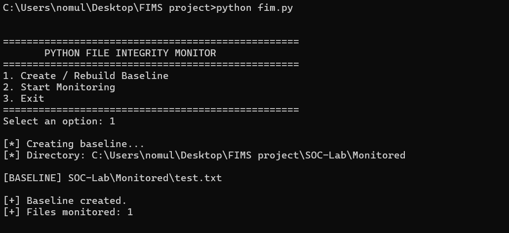

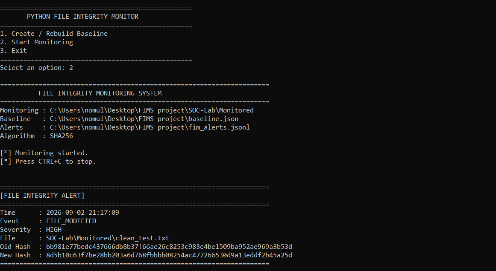

### V2 — Dashboard

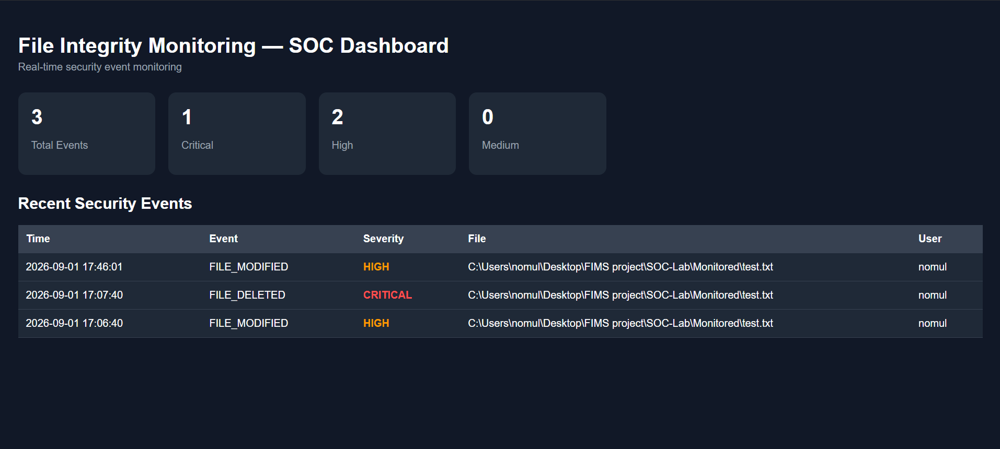

### V3 — Investigation

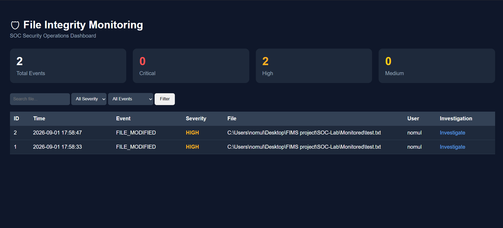

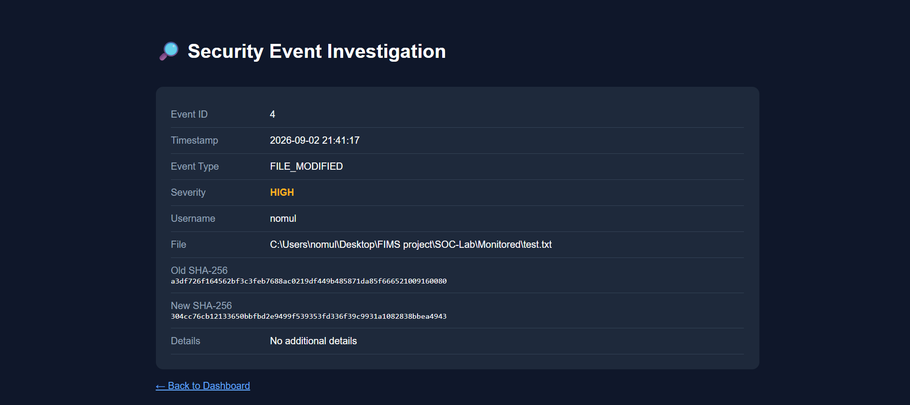

### V4 — Windows Event 4663

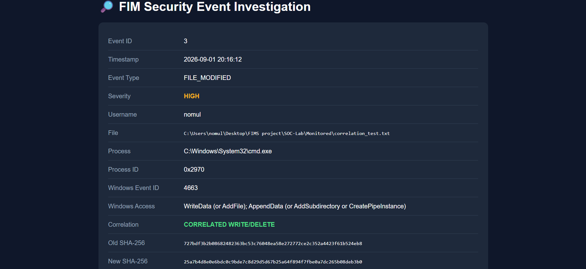

### V5 — SOC Triage

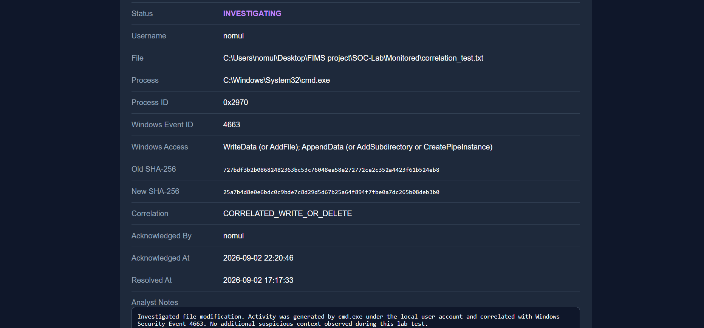

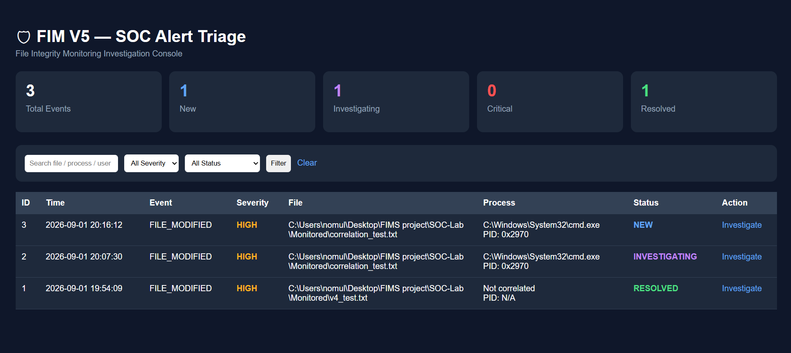

### V6 — Sysmon Event 11

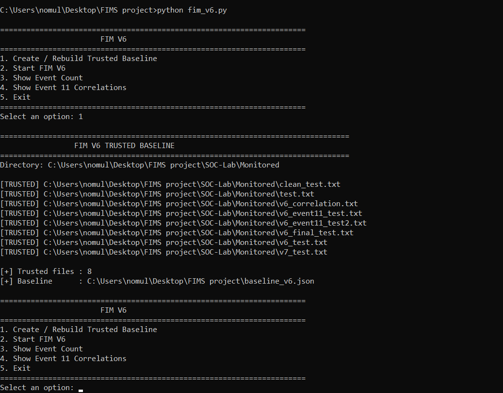

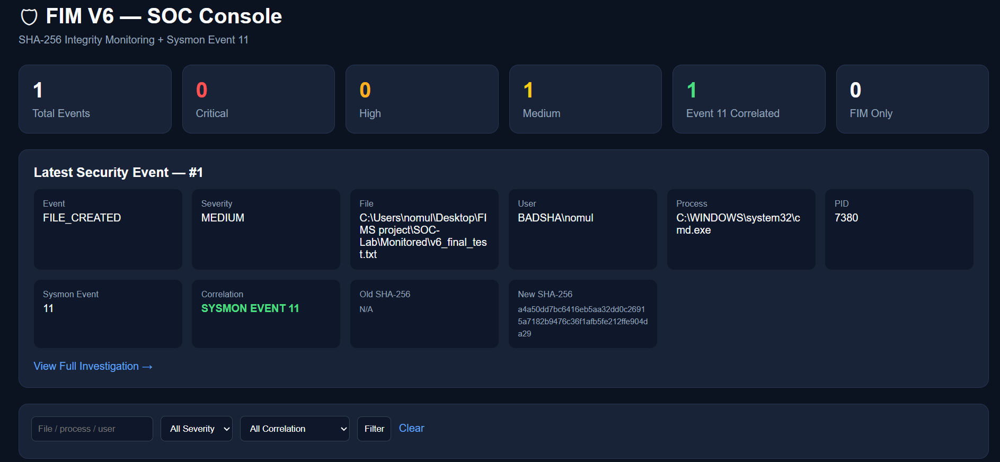

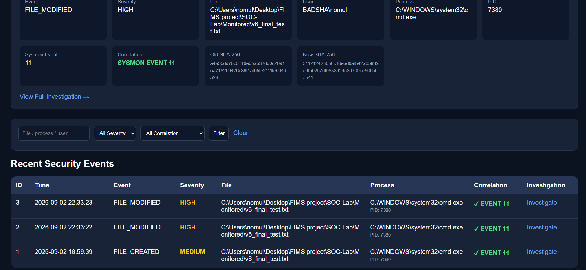

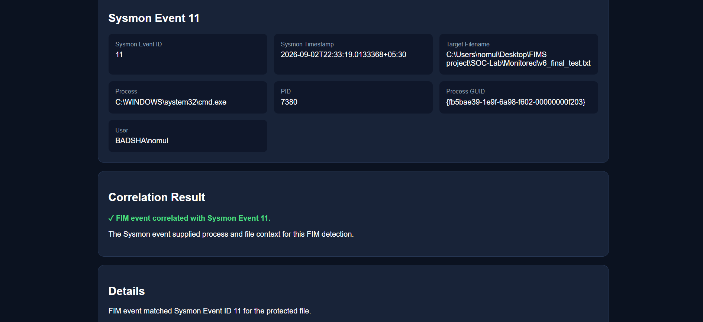

### V7 — Mini-SIEM

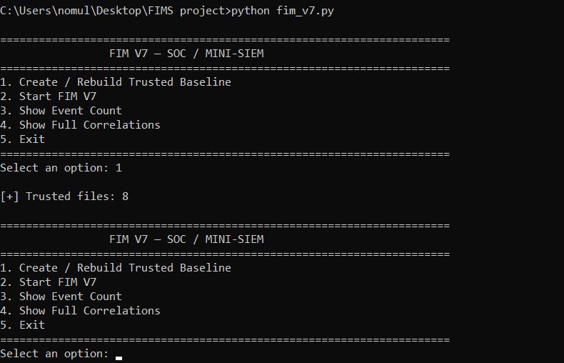

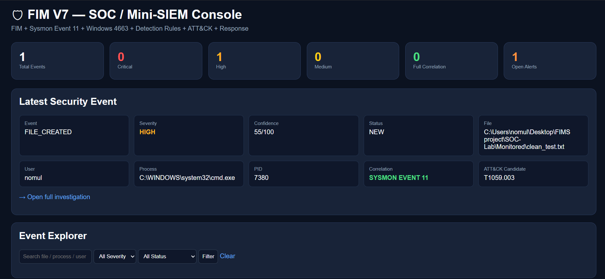

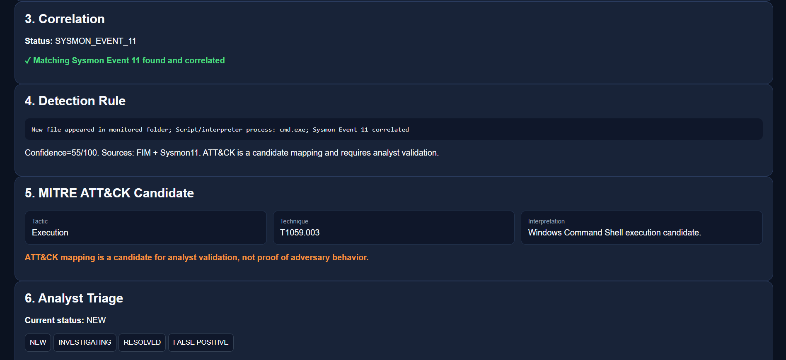

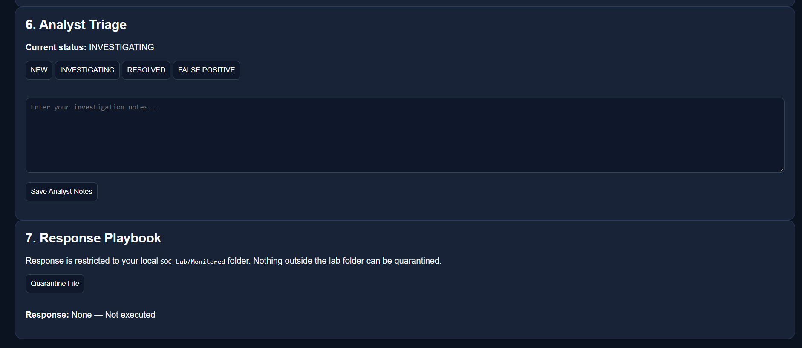

---

## Technology Stack

- Python
- Watchdog
- Flask
- SQLite
- Microsoft Sysmon
- Windows Security Event Logs
- SHA-256
- REST API
- HTML / Jinja templates

---

## Quick Start

Clone the repository:

```bash
git clone https://github.com/CypherHarsh0/windows-fim-mini-siem.git
cd windows-fim-mini-siem
```

Install dependencies:

```bash
pip install -r requirements.txt
```

Run the required project version as needed:

```bash
python fim_v1.py
```

For later versions, use the corresponding script:

```text
fim_v2.py
fim_v3.py
fim_v4.py
fim_v5.py
fim_v6.py
fim_v7.py
```

---

## Sysmon Configuration

The project includes the Sysmon configuration used for FIM-related telemetry:

```text
config/sysmon-fim.xml
```

V6 uses Sysmon Event ID 11 correlation.

V7 expands the correlation workflow by using Sysmon Event ID 11 together with Windows Security Event 4663.

---

## Investigation Workflow

The project follows a simplified SOC investigation lifecycle:

```text
File Activity
     |
     v
FIM Detection
     |
     v
Event Correlation
     |
     v
Detection / Scoring
     |
     v
Investigation
     |
     v
Analyst Notes
     |
     v
Status Update
     |
     v
Controlled Response
     |
     v
Audit Logging
```

---

## Security Design

The project is designed for a controlled Windows security lab environment.

Important design principles include:

- Trusted SHA-256 baselines are used as the reference state.
- Endpoint telemetry is correlated with file activity when available.
- ATT&CK mappings are treated as candidate context, not proof of malicious behavior.
- Response actions are controlled rather than automatically executed.
- Quarantine is restricted to the designated lab environment.
- Analyst actions are recorded in audit logs.

---

## Scope & Limitations

This is a learning and portfolio project designed to demonstrate practical SOC concepts.

It is not intended to replace a production enterprise SIEM, EDR, or full-scale SOAR platform.

Detection quality depends on:

- Baseline accuracy
- Available Windows telemetry
- Sysmon configuration
- Event timing
- Correlation windows
- Analyst validation

---

## Learning Outcomes

This project demonstrates practical experience with:

- File Integrity Monitoring
- SHA-256 hashing
- Windows event analysis
- Sysmon telemetry
- Security event correlation
- SOC investigation workflows
- Alert triage
- Detection engineering concepts
- MITRE ATT&CK contextualization
- SQLite event storage
- Flask dashboards
- REST APIs
- Controlled response workflows
- Security audit logging

---

## Future Improvements

Potential future enhancements include:

- More advanced detection rules
- Additional Sysmon event correlation
- Improved authentication and access control
- Threat intelligence enrichment
- Detection rule configuration through the UI
- More advanced dashboards and visualizations
- Alert deduplication
- Investigation timelines
- Production-grade deployment
- Integration with external SIEM platforms

---

## Author

**CypherHarsh0**

Windows File Integrity Monitoring & Mini-SIEM